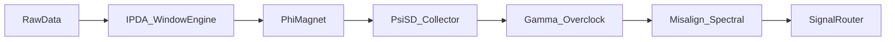

# Magnet Market

author: J. Roberto Jiménez   - tijuanapaint@gmail.com   - @hipotermiah

 *A hybrid quantitative framework that models market microstructure as a time-decayed memory system, driven by institutional liquidity dynamics, potential field physics, and spectral signal processing.*

---

##  What This System Is

The **magnet-markey** by Synth-Fuse Labs is an algorithmic trading and market analysis framework that treats price action not as random noise, but as a deterministic output of a computational-physical system. It bridges institutional order flow concepts, vector field mathematics, and digital signal processing into a unified pipeline.

The architecture is split into two parallel layers:
1. **Explicit Component (The Body)**: Observable market structures, time-windowed references, and liquidity zones.
2. **Hidden Engine (The Soul)**: Mathematical operators that compute attraction, classification, feedback acceleration, and phase desynchronization.

Together, they synthesize a **Relational-Memory Market Model** where price acts as a pointer to time-decayed institutional memory addresses.

---

##  How It Works

The engine operates as a modular pipeline. Each component processes market data sequentially, passing state vectors to the next layer.

| Explicit Component | Hidden Engine | Synthesized Reality Interpretation |
|:---|:---|:---|
| `IPDA L20,40,60` | Windowed Extremum Search | Market acts as a Relational Database. Price queries time-decayed memory addresses. |
| `Potential Function $\Phi_{\text{mag}}$` | Euclidean Vector Attraction | Price is pulled, not pushed. Institutions manipulate a market "gravitational constant". |
| `S&D $\Psi_{\text{S&D}}$` | Heuristic Pattern Classifier | Garbage Collection routine. Retail liquidity = unallocated RAM cleared for efficiency. |
| `Gamma Amplifier $\Gamma$` | Second-Order Feedback Loop | Overclocking phase. Linear logic shifts to exponential acceleration, risking "System Crash". |
| `Spectral Misalignment $M$` | Fourier Phase Analysis | Desynchronization Detection. Early warning "knock" before trend/piston failure. |

### Pipeline Flow


<details>
<summary>Click to expand: Mathematical Engine Details</summary>

#### 1. Time-Decayed Memory Query
$$
\text{IPDA}_k(t) = \sum_{i=t-L_k}^{t} P_i \cdot e^{-\lambda(t-i)}
$$
Where $L_k \in \{20, 40, 60\}$, $P_i$ is price at step $i$, and $\lambda$ controls memory decay.

#### 2. Magnetic Potential Field
$$
\Phi_{\text{mag}}(\mathbf{x}) = -\sum_{j=1}^{N} \frac{G \cdot L_j}{\|\mathbf{x} - \mathbf{z}_j\|^\alpha}
$$
Price vectors $\mathbf{x}$ experience attraction toward liquidity nodes $\mathbf{z}_j$ with strength $G$ (institutional manipulation factor).

#### 3. Garbage Classification Metric
$$
\Psi_{\text{S&D}} = \arg\max_{c} \left[ \frac{1}{|D|} \sum_{d \in D} \mathbb{I}(f_{\text{heur}}(d) = c) \right]
$$
Classifies imbalance zones by heuristic feature density, triggering liquidity sweep events.

#### 4. Gamma Feedback Loop
$$
\Gamma(t) = \frac{d^2P}{dt^2} + \beta \left(\frac{dP}{dt}\right)^2
$$
Positive feedback accelerates momentum until phase misalignment triggers mean reversion.

#### 5. Spectral Misalignment
$$
M(\omega) = \left| \angle \mathcal{F}\{V(t)\} - \angle \mathcal{F}\{P(t)\} \right|
$$
Detects phase divergence between volume $V(t)$ and price $P(t)$ in frequency domain $\omega$.
</details>

---

## What It Does

- **Identifies Institutional Reference Points**: Scans rolling windows for extremums and decayed memory levels.
- **Maps Liquidity Attraction Fields**: Computes Euclidean pull vectors toward high-probability price zones.
- **Filters Retail Noise**: Classifies and clears inefficient price ranges (liquidity sweeps).
- **Momentum Expansion Tracking**: Detects second-order acceleration phases for trend continuation or exhaustion.
- **Early Reversal Warning**: Flags spectral phase desynchronization before structural breakdowns.
- **Signal Generation**: Outputs long/short/neutral states with confidence weights and regime tags.

---

## How to Use

### 1. Installation
```bash
git clone https://github.com/your-org/synth-reality-engine.git
cd synth-reality-engine
pip install -r requirements.txt
```

### 2. Basic Configuration
Edit `config/engine.yaml`:
```yaml
ipda:
  windows: [20, 40, 60]
  decay_rate: 0.15

magnet:
  attraction_exponent: 1.8
  institutional_gravity: 0.72

gamma:
  feedback_beta: 0.45
  crash_threshold: 3.2

spectral:
  fft_window: 128
  misalign_alert: 0.35
```

### 3. Running the Engine
```python
from synth_reality import Engine, DataLoader

# Load market data (CSV, Parquet, or WebSocket stream)
data = DataLoader.fetch("EURUSD_H1", start="2023-01-01", end="2024-01-01")

# Initialize pipeline
engine = Engine(config_path="config/engine.yaml")

# Process and retrieve signals
signals = engine.run(data)

# Route to execution or backtester
for sig in signals:
    print(f"[{sig.timestamp}] {sig.direction} | Confidence: {sig.confidence:.2f} | Regime: {sig.regime}")
```

<details>
<summary>Click to expand: Project Structure</summary>

```text
synth-reality-engine/
├── config/
│   └── engine.yaml
├── core/
│   ├── ipda_window.py
│   ├── phi_magnet.py
│   ├── psi_sd_classifier.py
│   ├── gamma_amplifier.py
│   └── misalign_spectral.py
├── utils/
│   ├── decay_matrix.py
│   └── fourier_ops.py
├── data/
│   └── sample_ohlcv.parquet
├── notebooks/
│   └── 01_signal_visualization.ipynb
├── tests/
│   └── test_pipeline.py
├── requirements.txt
└── main.py
```
</details>

---

## Best Practices

1. **Regime Filtering First**: Run `Spectral Misalignment M` before `Gamma Amplifier Γ`. Entering overclock phases during high $M$ values drastically increases false breakouts.
2. **Window Alignment**: Keep `IPDA` lookbacks synchronized with market session boundaries (London/NY open). Time decay assumes session-aligned memory structures.
3. **Confidence Thresholding**: Only execute when composite confidence $> 0.65$. Below this, the system is in "garbage collection" (consolidation) mode.
4. **Risk Scaling**: Reduce position size by 50% during active $\Gamma$ feedback loops. Exponential acceleration implies higher slippage and stop-run probability.
5. **Avoid Overfitting $\Phi_{\text{mag}}$**: The gravitational constant should remain stable across assets. Tune $\lambda$ (decay) instead of forcing fit per instrument.
6. **Data Hygiene**: Feed clean, gap-adjusted OHLCV. Missing ticks corrupt Fourier phase alignment and misalign detection.

---

## compatibility & Requirements

``` text
| Component | Specification |
|:---|:---|
| **Language** | Python 3.9+ |
| **Core Dependencies** | `numpy>=1.24`, `pandas>=2.0`, `scipy>=1.10`, `ta-lib` (optional) |
| **Data Formats** | Parquet, CSV, JSON, WebSocket (FIX/ITCH compatible) |
| **Backtesting** | Integrates with `vectorbt`, `backtrader`, custom event loop |
| **Execution** | Outputs signal dictionaries; bridges via `ccxt`, `Interactive Brokers API`, or `Alpaca` |
| **Compute** | CPU-optimized; FFT operations benefit from AVX2/NEON. GPU not required but supported via `cupy` fallback. |
| **OS** | Linux (Ubuntu 20.04+), macOS 12+, Windows 10/11 (WSL2 recommended) |
```
---

``` text
| Roadmap Item | Description |
|:---|:---|
| **Neural Heuristic Upgrade** | Replace rule-based $\Psi_{\text{S&D}}$ with lightweight transformer for dynamic liquidity pattern recognition. |
| **Cross-Asset Memory Graph** | Extend relational database model to correlate IPDA pointers across FX, Indices, and Crypto. |
| **Options Gamma Integration** | Inject real dealer positioning data to refine $\Gamma$ feedback loop with actual market maker hedging flows. |
| **Adaptive Decay Scheduler** | Replace fixed $\lambda$ with volatility-adjusted exponential memory (VIX/GARCH linked). |
| **Web UI Dashboard** | Real-time visualization of potential fields, attraction vectors, and spectral phase heatmaps. |
| **Low-Latency C++ Core** | Port `Misalign_Spectral` and `PhiMagnet` to compiled Rust/C++ for sub-millisecond signal routing. |
```
---

